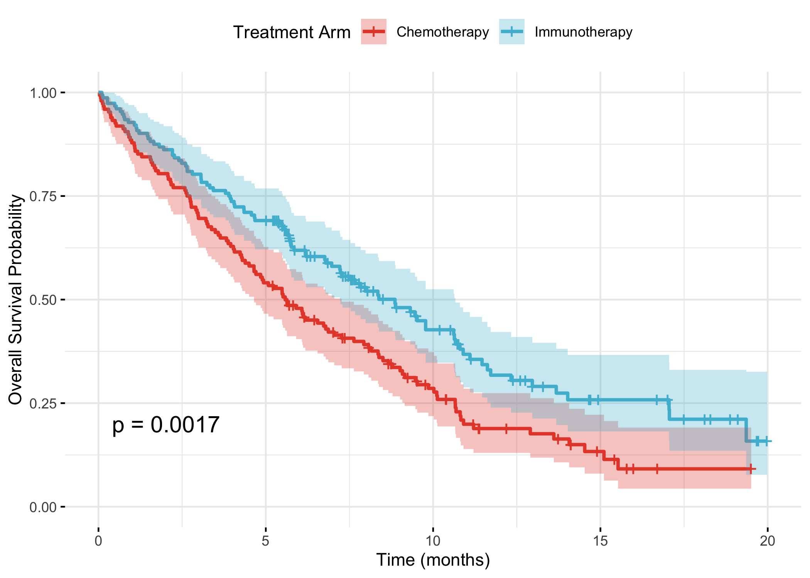
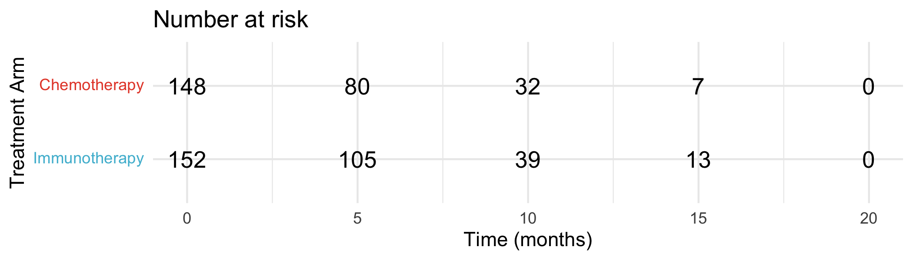
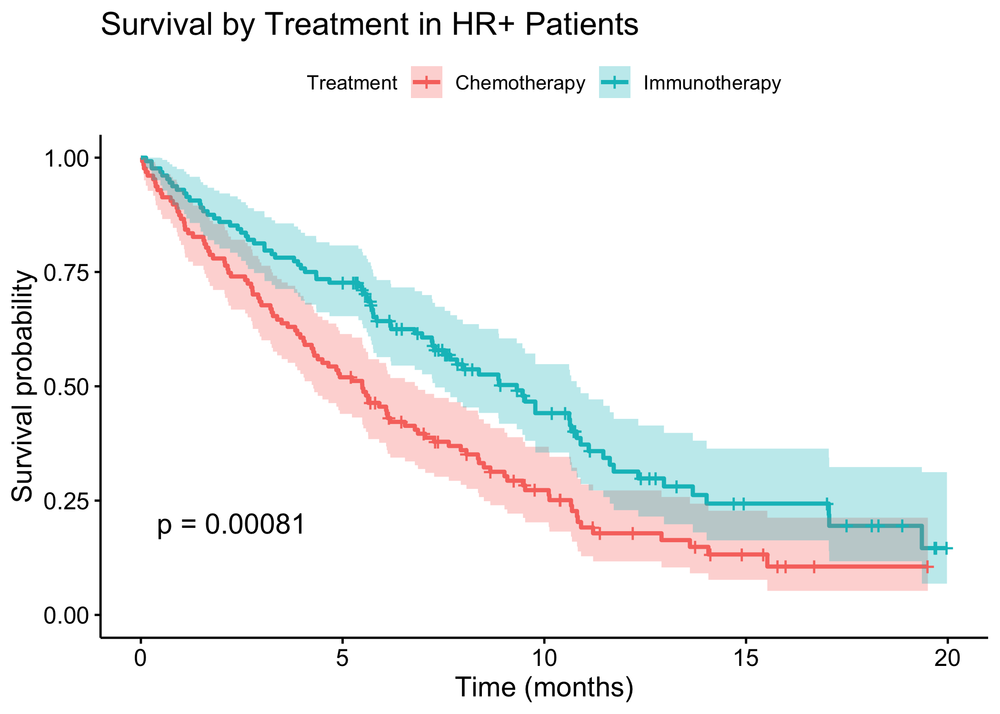
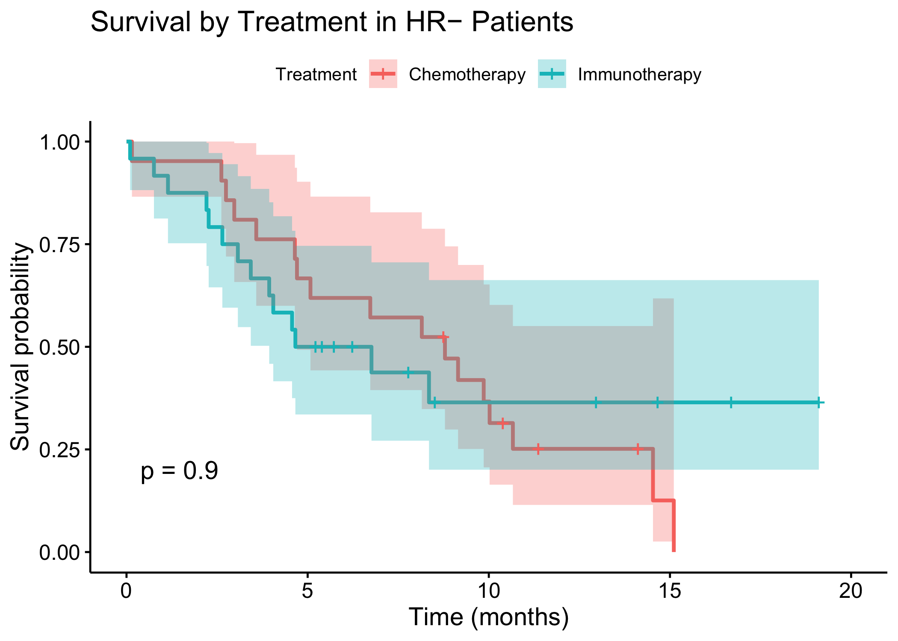
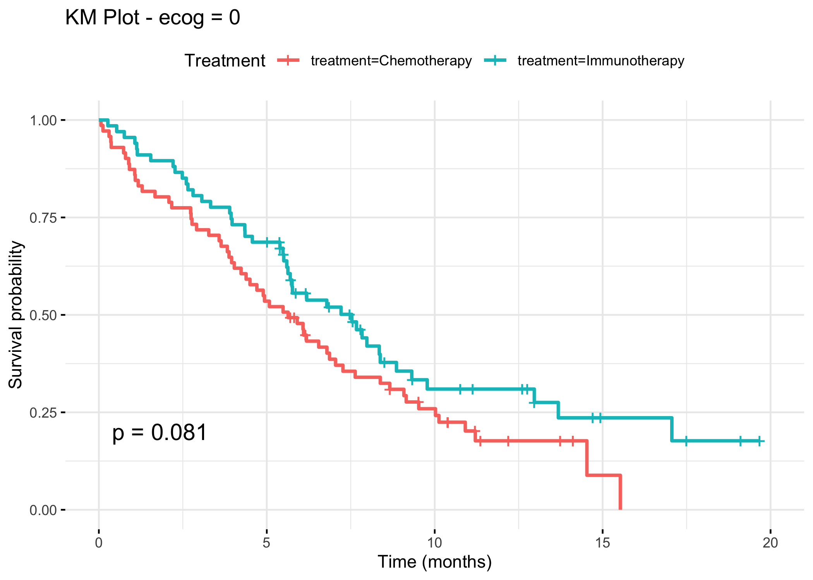
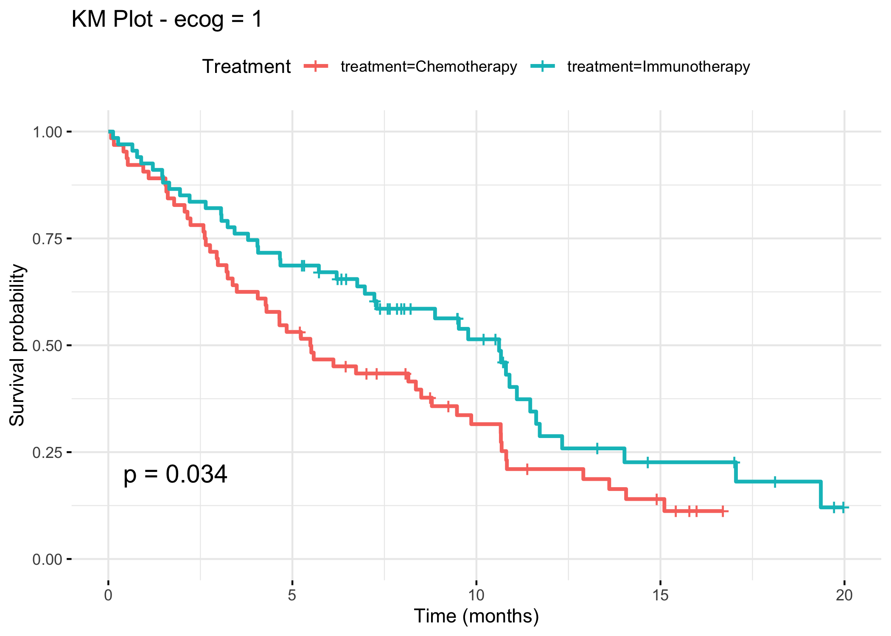
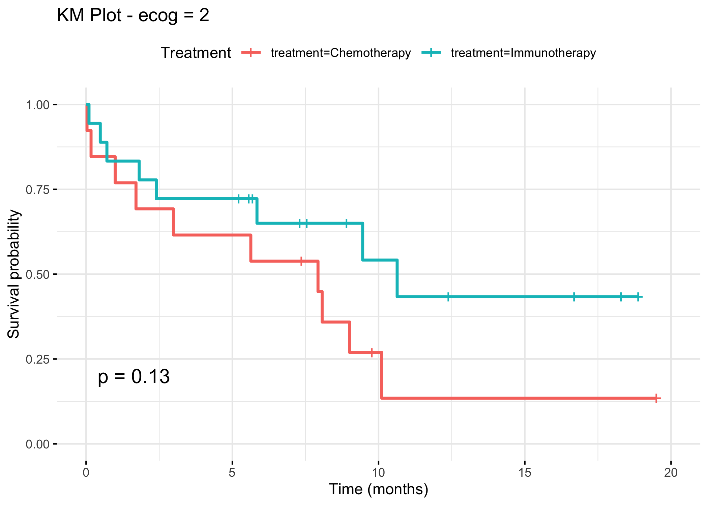
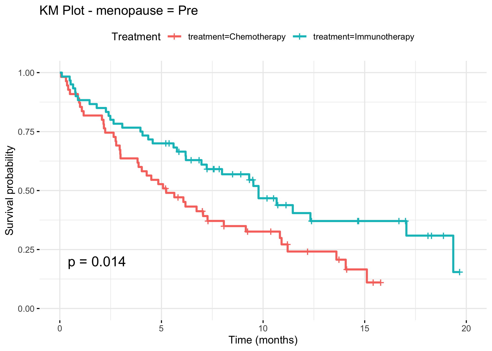
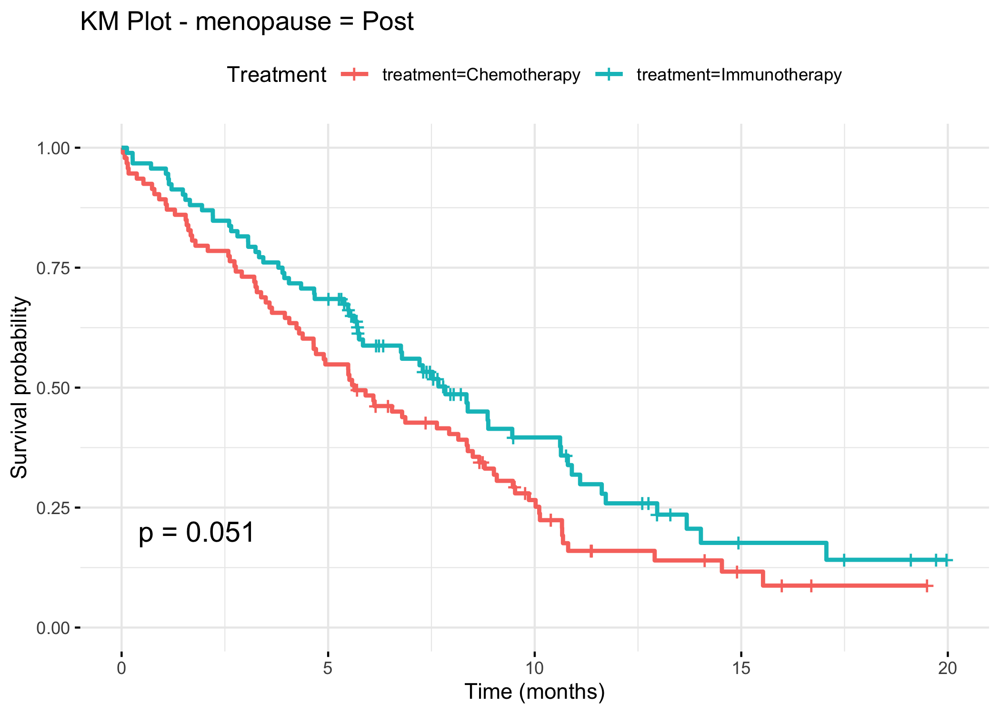
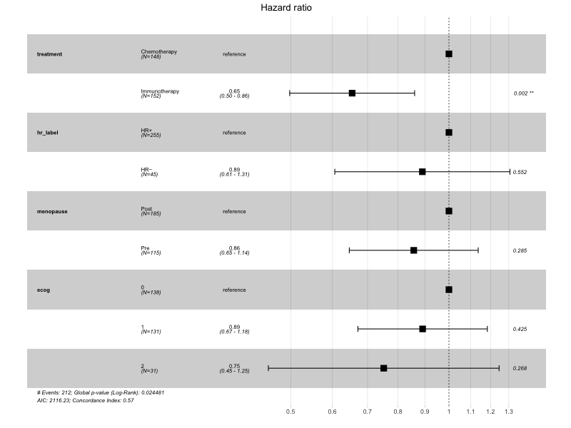

# BreastCancer-ClinicalTrial-Sim  
An R-based pipeline for simulating a randomized controlled trial (RCT) comparing immunotherapy versus chemotherapy in HR+/HER2− metastatic breast cancer. This pipeline includes data simulation, power analysis, survival modeling, subgroup assessment, and reproducible reporting.

## Summary  
1. Simulate baseline demographics, treatment allocation, and survival outcomes for a breast cancer patient group 
2. Estimate sample size required to detect a survival benefit using Schoenfeld’s method  
3. Analyze overall and progression-free survival with Kaplan-Meier curves and median survival estimates  
4. Fit Cox proportional hazards models, including stratified subgroup hazard ratios  
5. Generate subgroup-specific survival curves for ECOG status, hormone receptor status, and menopausal state  
6. Perform log-rank tests and test for treatment-by-subgroup interactions  
7. Simulate and tabulate adverse event rates across treatment arms  
8. Compile key results, visualizations, and statistical summaries into an HTML report

## Project Structure  
```
BreastCancerTrial_Sim/
├── scripts/                              # R scripts for simulation and analysis
│   ├── 01_simulate_breast_cancer_data.R    # Simulate trial cohort data
│   ├── 02_sample_size_calc.R               # Schoenfeld sample size estimation
│   ├── 03_kaplan_meier_analysis.R          # KM survival curves + median survival
│   ├── 04_cox_model_subgroup.R             # Cox model + subgroup HRs
│   ├── 05_subgroup_km_curves.R             # KM plots for ECOG, HR status, menopause
│   ├── 06_logrank_interaction_tests.R      # Log-rank tests + interaction p-values
│   ├── 07_subgroup_km_plots.R              # Forest and subgroup plots
│   └── 08_generate_summary.R               # Combine results into HTML report
│
├── results/                                # Output figures, tables, and HTML summary report
│   ├── figures/
│   │   ├── km_os_curve.png
│   │   ├── km_os_curve_risktable.png
│   │   ├── forest_subgroups.png
│   │   ├── km_hr_positive.png
│   │   ├── km_hr_negative.png
│   │   └── subgroups/
│   │       ├── ecog_0_KM.png
│   │       ├── ecog_1_KM.png
│   │       ├── ecog_2_KM.png
│   │       ├── hr_label_HR+_KM.png
│   │       ├── hr_label_HR−_KM.png
│   │       ├── menopause_Pre_KM.png
│   │       └── menopause_Post_KM.png
│   ├── tables/
│   │   └── cox_model_summary.csv
│   └── summary_report.html
│
├── data/
│   └── simulated_clinical_data.csv         # Generated data file
│
├── clinical_sap.md                         # Statistical Analysis Plan (SAP)
├── README.md                               # Project overview and instructions
├── environment.yml                         # Conda environment for R
└── .gitattributes                          # Language detection config for GitHub
```

## Installation  

1. Clone the repository:
```bash
git clone https://github.com/yourusername/breast_cancer_trial_sim.git
cd breast_cancer_trial_sim
```

2. Create and activate a Conda environment:
```bash
conda create -n clinical_r r-base=4.3
conda activate clinical_r
```

3. Install R and required R packages:
```bash
Rscript install.packages(c("simstudy", "survival", "survminer", "ggplot2", "gtsummary", "data.table"))
```

> Alternatively, use provided `environment.yml` to build the environment with R and required packages.
```bash
conda env create -f environment.yml
conda activate clinical_r
```
---

## Running the Pipeline

Run each script sequentially from the `scripts/` directory. 
Output files will be saved to the `results/` folder.

---

### Step 1:  *SIMULATE CLINICAL DATA*  
```bash
Rscript 01_simulate_breast_cancer_data.R
```
**Output:**   
1. Full synthetic patient dataset
  
  ```simulated_clinical_data.csv```

---

### Step 2:  *ESTIMATE SAMPLE SIZE*  
```bash
Rscript 02_sample_size_calc.R
```

---

### Step 3:  *PERFORM KAPLAM-MEIER SURVIVAL ANALYSIS*  
```bash
Rscript scripts/03_kaplan_meier_analysis.R
```
**Output:**  
1. Kaplan-Meier plot for overall survival (km_os_curve.png)
     
2. Kaplan-Meier plot with risk table (km_os_curve_risktable.png)
     

---

### Step 4:  *COX MODEL AND SUBGROUP HAZARD RATIOS*  
```bash
Rscript 04_subgroup_analysis.R
```
**Outputs:**  
1. Hazard ratios for treatment and subgroups

   ```cox_model_summary.csv```

---

### Step 5: *GENERATE SUBGROUP-SPECIFIC KM CURVES*
```bash
Rscript scripts/05_subgroup_km_curves.R
```
**Output:**
Kaplan-Meier plots:
1. HR-positive patients  (km_hr_positive.png)
   
2. HR-negative patients  (km_hr_negative.png)
   
3. ECOG = 0  (ecog_0_KM.png)
   
4. ECOG = 1  (ecog_1_KM.png)
   
5. ECOG = 2  (ecog_2_KM.png)
   
6. Pre-menopausal patients  (menopause_Pre_KM.png)
   
7. Post-menopausal patients  (menopause_Post_KM.png)
   

---

### Step 6: *LOG-RANK INTERACTION TESTS*
```bash
Rscript scripts/06_logrank_interaction_tests.R
```

**Output:**  
1. p-values for interaction by subgroup (console) 

---

### Step 7: *FOREST PLOT AND SUBGROUP VISUALIZATIONS*
```bash
Rscript scripts/07_subgroup_km_plots.R
```

**Output:**  
1. Forest plot of subgroup hazard ratios  (forest_subgroups.png)
   

---

### Step 8: *GENERATE HTML SUMMARY REPORT*
```bash
Rscript scripts/08_generate_summary.R
```

**Output:**  
1. Final report compiling figures, tables, and key results (summary_report.html)
   
  [Open summary_report.html](results/summary_report.html)

---

## Dataset  

This project uses **fully simulated data** generated via the `simstudy` package to replicate characteristics of HR+/HER2− metastatic breast cancer trials. No real patient data are used.

- **Design:** Phase II, 1:1 randomized, immunotherapy vs. chemo  
- **Sample size:** n = 300 (simulated); power calculation suggests 633 needed for HR = 0.75  
- **Event model:** Exponential survival with random censoring  
- **Endpoints:** Overall Survival (OS), Progression-Free Survival (PFS), Adverse Events  

## Documentation  

📄 See the [Statistical Analysis Plan (SAP)](clinical_sap.md) for detailed methodology, rationale, and endpoint definitions.

## Notes  
- All results are saved to the `results/` directory  
- This pipeline is fully reproducible with R 4.3+  
- Ideal for showcasing survival analysis, power calculations, and clinical trial simulation in bioinformatics or biostatistics portfolios

## Citation  
If referencing this project, please cite the Statistical Analysis Plan and mention simulated methodology inspired by oncology immunotherapy trials (e.g., IMpassion130, KEYNOTE-355).
